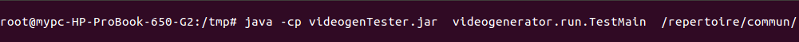
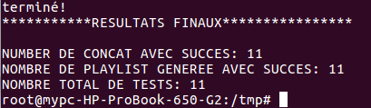
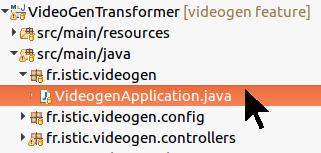
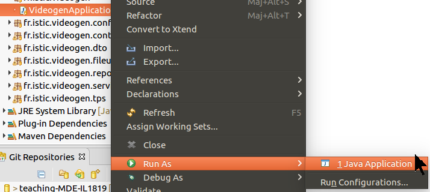

# Projet IDM 1819  VideoGen

## L'étude empirique

* Le ficher contenant l'étude empirique se trouve dans le dossier `etude`

## D'abords le VideogenTester:
## Comment ça marche?

* le fichier `videogenTester.jar` est le programme java qui va servir à tester sur les vidéos des autres membres de la promotion.
* Voici la commande à utiliser sur un terminal:

`java -cp videogenTester.jar videogenerator.run.TestMain /repertoire/commun/ `

### Exemple : 
* Voici un exemple de commande :

* Le programme affiche un bilan des tests:

## Enfin le site Web:

## Comment ça marche?

* Dans Eclipse démarrer le serveur Spring

* Un clique droit sur `VideoGenApplication.java`  ---> Run As ---> Java Application

* Dans un navigateur tapez l'url `http://localhost:8080/web`

